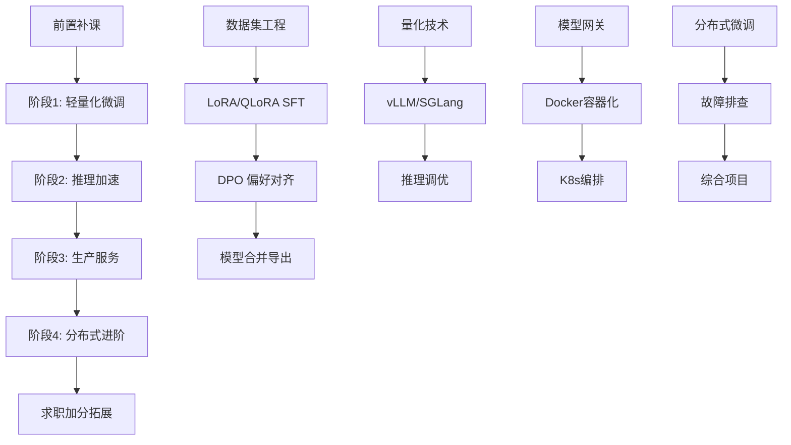
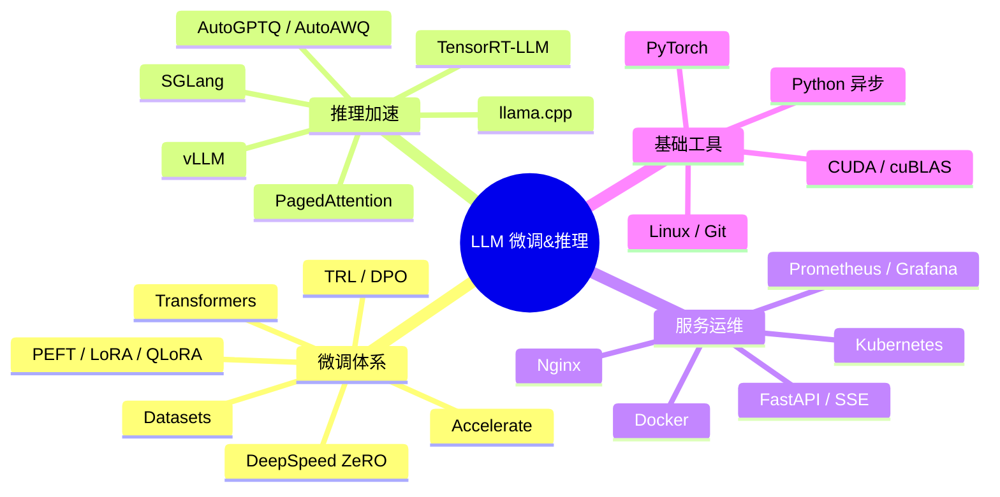

# 🚀 LLM 微调&推理部署工程师 完整学习路线

> **从入门到工业级部署：4大阶段，系统掌握大模型微调、推理加速、生产服务、分布式训练**

[](LICENSE)
[](https://www.python.org/)
[](https://pytorch.org/)
[](CONTRIBUTING.md)

---

## 📖 目录

- [前置要求](#-前置要求)
- [学习路线图](#-学习路线图)
- [阶段0：前置补课](#阶段0前置补课)
- [阶段1：轻量化微调全栈能力](#阶段1轻量化微调全栈能力)
- [阶段2：大模型推理加速专项](#阶段2大模型推理加速专项)
- [阶段3：工业级线上服务开发--容器化运维](#阶段3工业级线上服务开发--容器化运维)
- [阶段4：分布式进阶--问题排查--综合实战](#阶段4分布式进阶--问题排查--综合实战)
- [求职加分拓展](#-求职加分拓展)
- [技术栈全景图](#-技术栈全景图)
- [学习资源推荐](#-学习资源推荐)
- [Star 历史](#star-历史)

---

## 🎯 前置要求

完成赛道A基础：
- ✅ Python 基础（函数、类、列表推导式）
- ✅ PyTorch 基础（Tensor 操作、自动求导）
- ✅ Transformer 理论（Self-Attention、Encoder-Decoder）
- ✅ FastAPI 基础（路由、请求体、响应模型）
- ✅ RAG 基础（向量检索、LangChain/LlamaIndex 入门）
- ✅ 会调用开源模型（Ollama / Transformers 跑通 Qwen/Llama）

---

## 🗺️ 学习路线图



---

## 阶段0：前置补课

> 📂 代码目录：[`prerequisites/`](prerequisites/)

### 1. Python 进阶

| 主题 | 内容 | 练习 |
|------|------|------|
| 异步编程 | `async/await`、`asyncio.gather`、事件循环 | 写一个异步爬虫 |
| 类继承 | `super()`、MRO、抽象基类 `ABC` | 设计模型加载器类层次 |
| 装饰器 | 函数装饰器、带参数装饰器、`functools.wraps` | 写计时/重试装饰器 |
| 日志 | `logging` 模块、Handler、Formatter | 配置训练日志系统 |
| 单元测试 | `pytest`、fixture、mock、参数化测试 | 为数据处理写测试 |

📓 配套 Notebook：[`prerequisites/01_python_advanced.ipynb`](prerequisites/01_python_advanced.ipynb)

### 2. PyTorch 基础

| 主题 | 内容 | 练习 |
|------|------|------|
| Dataset/DataLoader | 自定义 Dataset、collate_fn、多进程加载 | 封装对话数据集 |
| 自动混合精度 | `torch.cuda.amp`、GradScaler | 对比 AMP 前后显存 |
| nn.Module | 模型封装、`forward()`、参数冻结 | 手写一个 Mini-GPT |

📓 配套 Notebook：[`prerequisites/02_pytorch_basics.ipynb`](prerequisites/02_pytorch_basics.ipynb)

### 3. Transformer 深入

| 主题 | 内容 |
|------|------|
| 自注意力机制 | Q/K/V 计算、Multi-Head Attention、Mask |
| RoPE 位置编码 | 旋转位置编码原理、与 Sinusoidal 对比 |
| 对话模板 | Chat Template、System/User/Assistant 角色 |
| Tokenizer 原理 | BPE/WordPiece、特殊 Token、Chat Template 应用 |

📓 配套 Notebook：[`prerequisites/03_transformer_deep_dive.ipynb`](prerequisites/03_transformer_deep_dive.ipynb)

### 4. 工程工具

```bash
# Linux 必备命令
nvidia-smi -l 1              # 实时 GPU 监控
tmux new -s train            # 后台训练
tmux attach -t train         # 恢复会话
htop                          # 进程查看
du -sh *                      # 磁盘使用

# Git 工作流
git checkout -b exp/lora-fix  # 实验分支
git stash && git pop          # 临时存储
git log --oneline -10         # 提交历史
```

### 🔑 前置验收

> 📓 配套 Notebook：[`prerequisites/04_streaming_chat_api.ipynb`](prerequisites/04_streaming_chat_api.ipynb)

**任务**：用 Ollama / Transformers 本地跑通 Qwen/Llama2，写一个流式对话 API

```python
# 验收标准代码骨架
from fastapi import FastAPI
from fastapi.responses import StreamingResponse
from transformers import AutoModelForCausalLM, AutoTokenizer

app = FastAPI()

@app.post("/chat/stream")
async def chat_stream(messages: list[dict]):
    # 1. 应用 Chat Template
    # 2. 模型推理生成
    # 3. 流式返回 SSE
    async def generate():
        for token in model.generate(...):
            yield f"data: {token}\n\n"
    return StreamingResponse(generate(), media_type="text/event-stream")
```

---

## 阶段1：轻量化微调全栈能力

> 📂 代码目录：[`stage1-finetuning/`](stage1-finetuning/)
>
> ⏱️ 建议学习周期：4-6 周

### 🎯 目标

独立完成垂类模型微调，掌握主流轻量化微调方案，能解决显存不足、过拟合、输出格式混乱等问题。

---

### 模块1：数据集工程

📓 Notebook：[`stage1-finetuning/01_dataset_engineering.ipynb`](stage1-finetuning/01_dataset_engineering.ipynb)

#### 1.1 指令数据集规范

**三种主流对话格式：**

| 格式 | 结构 | 适用场景 |
|------|------|----------|
| **ShareGPT** | `{"conversations": [{"from": "human", "value": "..."}, {"from": "gpt", "value": "..."}]}` | 通用对话 |
| **Alpaca** | `{"instruction": "...", "input": "...", "output": "..."}` | 指令微调 |
| **Qwen Chat** | `{"messages": [{"role": "user", "content": "..."}, {"role": "assistant", "content": "..."}]}` | Qwen 系列 |

#### 1.2 数据清洗 Pipeline

```python
# 标准数据清洗流程
def clean_dataset(dataset):
    return (dataset
        .filter(remove_duplicates)         # 1. 去重（MinHash/LSH）
        .filter(filter_low_quality)         # 2. 过滤短文本/乱码
        .filter(remove_harmful_content)     # 3. 移除违规内容
        .map(unify_format)                  # 4. 格式统一
        .map(apply_chat_template)           # 5. 应用对话模板
    )
```

#### 1.3 数据划分

```python
# 分层采样划分
from sklearn.model_selection import train_test_split

train, val = train_test_split(
    dataset, test_size=0.1, 
    stratify=dataset['category']  # 按类别分层
)
```

#### 📌 实战任务

> **自制 1 万条行业指令数据集**（客服/代码/法律任选）
>
> - 使用 `datasets` 库加载、清洗、划分
> - 可视化数据分布（长度分布、类别分布）
> - 人工抽检 100 条验证质量

---

### 模块2：LoRA/QLoRA 监督微调 (SFT)

📓 Notebook：[`stage1-finetuning/02_lora_qlora_sft.ipynb`](stage1-finetuning/02_lora_qlora_sft.ipynb)

#### 2.1 核心库

```python
from transformers import AutoModelForCausalLM, AutoTokenizer, TrainingArguments
from peft import LoraConfig, get_peft_model, TaskType
from trl import SFTTrainer
import torch
from datasets import load_dataset
```

#### 2.2 微调方案对比

| 方案 | 显存占用 (7B) | 训练速度 | 适用场景 |
|------|:------------:|:--------:|----------|
| 全量微调 | ~56GB | 慢 | A100 80G 单卡 |
| LoRA | ~18GB | 中 | 3090/4090 单卡 |
| QLoRA (4bit) | ~8GB | 中 | 消费级显卡 |
| Prefix Tuning | ~14GB | 快 | 简单任务 |

#### 2.3 LoRA 核心参数

```python
lora_config = LoraConfig(
    r=16,                    # rank：低秩矩阵维度（8/16/32/64）
    lora_alpha=32,           # 缩放因子（通常设为 r 的 2 倍）
    target_modules=[         # 目标层（Qwen/Llama 为 q_proj, v_proj）
        "q_proj", "v_proj", "k_proj", "o_proj",
        "gate_proj", "up_proj", "down_proj"
    ],
    lora_dropout=0.05,       # 防止过拟合
    bias="none",
    task_type=TaskType.CAUSAL_LM,
)
```

#### 2.4 超参调优体系

```python
training_args = TrainingArguments(
    output_dir="./output",
    num_train_epochs=3,              # epoch 数（小数据 3-5，大数据 1-2）
    per_device_train_batch_size=4,   # batch size
    gradient_accumulation_steps=4,   # 梯度累积 = 有效 batch=16
    learning_rate=2e-4,              # LoRA 推荐 1e-4 ~ 5e-4
    warmup_ratio=0.03,               # 3% warmup
    lr_scheduler_type="cosine",      # 余弦退火
    logging_steps=10,
    save_steps=500,
    fp16=True,                       # 混合精度
    gradient_checkpointing=True,     # 梯度重计算（省显存）
    optim="adamw_8bit",              # 8-bit 优化器
)
```

#### 2.5 显存优化大全

| 技术 | 显存节省 | 速度影响 | 代码 |
|------|:-------:|:-------:|------|
| 4-bit 量化 (NF4) | ~75% | 略慢 | `BitsAndBytesConfig(load_in_4bit=True)` |
| 梯度检查点 | ~40% | ~20% 慢 | `gradient_checkpointing=True` |
| 8-bit 优化器 | ~30% | 几乎无损 | `optim="adamw_8bit"` |
| CPU 卸载 | ~20% | 明显变慢 | `device_map="auto"` |
| Flash Attention | ~30% | 更快 | `use_flash_attention_2=True` |

#### 📌 实战项目

> **基于 Qwen2.5-7B 做垂类客服 LoRA 微调**
>
> 交付物：
> - 完整训练脚本
> - Loss 曲线可视化
> - 微调前后效果对比（同一批 prompt 的 A/B 测试）

---

### 模块3：人类偏好对齐 DPO

📓 Notebook：[`stage1-finetuning/03_dpo_alignment.ipynb`](stage1-finetuning/03_dpo_alignment.ipynb)

#### 3.1 RLHF vs DPO

```
RLHF 流程：SFT → 训练奖励模型 → PPO 强化学习
DPO 流程：SFT → 直接偏好优化（无需奖励模型！）
```

#### 3.2 偏好数据集构造

```python
# DPO 数据格式
dpo_sample = {
    "prompt": "解释什么是量子计算",
    "chosen": "量子计算是利用量子力学原理...（正确回答）",
    "rejected": "量子计算就是很快的计算...（错误/模糊回答）"
}
```

#### 3.3 DPO 训练

```python
from trl import DPOTrainer

dpo_trainer = DPOTrainer(
    model=model,
    ref_model=ref_model,      # 参考模型（冻结的 SFT 模型）
    beta=0.1,                 # KL 散度惩罚系数
    train_dataset=dpo_dataset,
    args=training_args,
)
dpo_trainer.train()
```

#### 📌 效果对比

| 指标 | SFT 模型 | DPO 对齐后 |
|------|:--------:|:----------:|
| 幻觉率 | 15% | 5% |
| 格式规范性 | 70% | 95% |
| 安全性评分 | 60% | 90% |

---

### 模块4：模型合并与导出

📓 Notebook：[`stage1-finetuning/04_model_merge_export.ipynb`](stage1-finetuning/04_model_merge_export.ipynb)

```python
# 1. LoRA 权重合并
from peft import PeftModel

base_model = AutoModelForCausalLM.from_pretrained("Qwen/Qwen2.5-7B")
model = PeftModel.from_pretrained(base_model, "./lora_adapter")
merged_model = model.merge_and_unload()
merged_model.save_pretrained("./qwen-7b-custom-merged")

# 2. GGUF 导出（llama.cpp）
# python llama.cpp/convert_hf_to_gguf.py ./qwen-7b-custom-merged --outtype q4_k_m

# 3. GPTQ 量化导出
# 使用 AutoGPTQ 进行 INT4 量化导出
```

#### 📌 版本管理规范

```
checkpoints/
├── v1_sft_epoch3/          # SFT 基线
├── v2_lora_r16_lr2e-4/     # LoRA 实验
├── v3_dpo_beta0.1/         # DPO 对齐
└── prod_v3_merged/         # 生产合并版
```

---

### ✅ 阶段1 验收标准

- [ ] 单卡 3090/4090 可完成 7B 模型 QLoRA 微调
- [ ] 能自主排查过拟合（验证 loss 上升）
- [ ] 能解决 loss 不收敛问题（调整 lr/warmup）
- [ ] 能解决显存 OOM（显存优化组合拳）
- [ ] 能修复对话模板错乱（Chat Template 调试）

---

## 阶段2：大模型推理加速专项

> 📂 代码目录：[`stage2-inference/`](stage2-inference/)
>
> ⏱️ 建议学习周期：3-4 周

### 🎯 目标

掌握主流推理框架、量化、并发优化，把微调后的模型做成高并发线上服务。

---

### 模块1：量化技术底层与实操

📓 Notebook：[`stage2-inference/01_quantization_techniques.ipynb`](stage2-inference/01_quantization_techniques.ipynb)

#### 1.1 量化精度对比

| 精度 | 大小 (7B) | 推理速度 | 精度损耗 | 工具 |
|------|:--------:|:--------:|:--------:|------|
| FP32 | 28GB | 1x (基准) | 0% | - |
| FP16 | 14GB | 1.5x | ~0% | Transformers |
| BF16 | 14GB | 1.5x | ~0% | Transformers |
| INT8 | 7GB | 2x | <0.5% | bitsandbytes |
| INT4 (GPTQ) | 3.5GB | 3x | ~1% | AutoGPTQ |
| INT4 (AWQ) | 3.5GB | 3.5x | ~0.5% | AutoAWQ |
| Q4_K_M (GGUF) | 4GB | 3x | ~1% | llama.cpp |

#### 1.2 量化实操

```python
# AutoAWQ INT4 量化
from awq import AutoAWQForCausalLM

model = AutoAWQForCausalLM.from_pretrained("Qwen/Qwen2.5-7B")
model.quantize(
    tokenizer=tokenizer,
    quant_config={"zero_point": True, "q_group_size": 128}
)
model.save_quantized("./qwen-7b-awq")
```

#### 1.3 KV Cache 与 PagedAttention

```
传统 KV Cache：每请求预分配连续显存 → 碎片化严重
PagedAttention：KV Cache 分页管理 → 显存利用率提升 2-4x
```

---

### 模块2：高性能推理框架

📓 Notebook：[`stage2-inference/02_vllm_deployment.ipynb`](stage2-inference/02_vllm_deployment.ipynb)  
📓 Notebook：[`stage2-inference/03_sglang_basics.ipynb`](stage2-inference/03_sglang_basics.ipynb)

#### 2.1 vLLM（工业界首选）

```python
# vLLM 一键部署 OpenAI 兼容 API
# 启动命令
# python -m vllm.entrypoints.openai.api_server \
#     --model ./qwen-7b-custom-merged \
#     --max-num-batched-tokens 8192 \
#     --max-num-seqs 256 \
#     --gpu-memory-utilization 0.95

# 客户端调用
from openai import OpenAI
client = OpenAI(base_url="http://localhost:8000/v1", api_key="not-needed")

response = client.chat.completions.create(
    model="qwen-7b-custom",
    messages=[{"role": "user", "content": "你好"}],
    stream=True
)
```

**vLLM 核心参数调优：**

| 参数 | 作用 | 建议值 |
|------|------|--------|
| `max-num-batched-tokens` | 批处理最大 token 数 | 8192-16384 |
| `max-num-seqs` | 最大并发序列数 | 128-256 |
| `gpu-memory-utilization` | 显存利用率 | 0.90-0.95 |
| `enable-prefix-caching` | 前缀缓存 | 开启 |

#### 2.2 SGLang（复杂推理场景）

```python
# SGLang RadixAttention 前缀缓存
import sglang as sgl

@sgl.function
def multi_turn(s, system_prompt, user_question):
    s += sgl.system(system_prompt)
    s += sgl.user(user_question)
    s += sgl.assistant(sgl.gen("answer", max_tokens=1024))
```

#### 2.3 TensorRT-LLM（极致性能）

```
流程：HF 模型 → 编译为 TensorRT Engine → Triton Server 部署
优势：FP8 量化 + 图优化 → 延迟降低 50%+
适用：大厂生产环境，A100/H100 集群
```

#### 2.4 框架性能对比

| 框架 | QPS (7B) | 首 Token 延迟 | 适用场景 |
|------|:--------:|:-------------:|----------|
| Transformers | 1 | 2000ms | 本地实验 |
| vLLM | 50+ | 50ms | 线上 API |
| SGLang | 60+ | 40ms | 多轮对话 |
| TensorRT-LLM | 80+ | 20ms | 极致优化 |

---

### 模块3：推理调优实战

📓 Notebook：[`stage2-inference/04_inference_optimization.ipynb`](stage2-inference/04_inference_optimization.ipynb)

#### 3.1 解码参数优化

```python
generation_config = {
    "temperature": 0.7,      # 创造性 (0=确定, 1=随机)
    "top_p": 0.9,            # 核采样
    "top_k": 50,             # Top-K 采样
    "max_tokens": 2048,      # 最大生成长度
    "repetition_penalty": 1.1, # 重复惩罚
    "presence_penalty": 0.0,   # 话题新颖度
}
```

#### 3.2 压测脚本

```python
# locust 压测
from locust import HttpUser, task, between

class LLMUser(HttpUser):
    wait_time = between(0.1, 0.5)
    
    @task
    def chat(self):
        self.client.post("/v1/chat/completions", json={
            "model": "qwen-7b",
            "messages": [{"role": "user", "content": "你好"}],
            "max_tokens": 256
        })
```

#### 3.3 性能优化 Checklist

- [ ] 开启 Prefix Caching → 相同前缀场景提速 2-5x
- [ ] 调整 `max-num-batched-tokens` → 吞吐最优值
- [ ] 启用 Flash Attention 2 → 降低 30% 显存
- [ ] 使用 FP8/INT8 KV Cache → 降低 50% KV 显存
- [ ] 多卡 Tensor Parallelism → 线性扩展吞吐

---

### ✅ 阶段2 验收标准

- [ ] 能独立完成 7B/13B 模型量化（GPTQ/AWQ/GGUF）
- [ ] 能用 vLLM 部署 OpenAI 兼容 API
- [ ] 可通过调参将单卡 QPS 提升数倍
- [ ] 能定位延迟高、显存溢出问题

---

## 阶段3：工业级线上服务开发 & 容器化运维

> 📂 代码目录：[`stage3-production/`](stage3-production/)
>
> ⏱️ 建议学习周期：3-4 周

### 🎯 目标

搭建可上线的生产级 LLM 服务，适配企业业务架构。

---

### 模块1：模型网关与多模型调度

📓 Notebook：[`stage3-production/01_model_gateway.ipynb`](stage3-production/01_model_gateway.ipynb)

#### 1.1 模型网关架构

```
                    ┌─────────────┐
                    │   Nginx LB   │
                    └──────┬──────┘
                           │
                    ┌──────▼──────┐
                    │  API Gateway │  ← FastAPI
                    │  - 鉴权      │
                    │  - 限流      │
                    │  - 路由      │
                    └──────┬──────┘
                           │
          ┌────────────────┼────────────────┐
          │                │                │
   ┌──────▼──────┐ ┌──────▼──────┐ ┌──────▼──────┐
   │ 通用模型     │ │ 客服模型     │ │ 代码模型     │
   │ Qwen-7B     │ │ Qwen-CS     │ │ Qwen-Code   │
   └─────────────┘ └─────────────┘ └─────────────┘
```

#### 1.2 核心功能实现

```python
# 1. 多模型路由
@app.post("/v1/chat/completions")
async def chat(request: ChatRequest):
    if request.model == "general":
        backend = "http://vllm-general:8000"
    elif request.model == "code":
        backend = "http://vllm-code:8000"
    return await proxy_to_backend(backend, request)

# 2. 限流中间件
from slowapi import Limiter
limiter = Limiter(key_func=get_remote_address)

@app.post("/v1/chat/completions")
@limiter.limit("100/minute")
async def chat(request: ChatRequest):
    ...

# 3. 熔断器
from tenacity import retry, stop_after_attempt

@retry(stop=stop_after_attempt(3))
async def proxy_to_backend(url, request):
    async with httpx.AsyncClient(timeout=30) as client:
        return await client.post(url, json=request.dict())
```

#### 1.3 灰度发布

```python
# 按比例路由流量到新旧模型
import random

async def route_model(request: ChatRequest):
    if random.random() < 0.1:   # 10% 流量到新模型
        return "vllm-model-v2"
    return "vllm-model-v1"
```

#### 1.4 全链路日志

```python
import structlog
logger = structlog.get_logger()

@app.post("/v1/chat/completions")
async def chat(request: ChatRequest):
    start = time.time()
    response = await proxy_to_backend(backend, request)
    elapsed = time.time() - start
    
    logger.info("chat_completion",
        model=request.model,
        input_tokens=response.usage.prompt_tokens,
        output_tokens=response.usage.completion_tokens,
        latency_ms=elapsed * 1000,
        status="success"
    )
    return response
```

---

### 模块2：Docker 容器化部署

📓 Notebook：[`stage3-production/02_docker_deployment.ipynb`](stage3-production/02_docker_deployment.ipynb)

#### 2.1 vLLM 推理镜像

```dockerfile
# Dockerfile
FROM nvidia/cuda:12.4.0-runtime-ubuntu22.04

RUN pip install vllm

# 预加载模型（可选，加速启动）
COPY ./models /models

EXPOSE 8000
CMD ["python", "-m", "vllm.entrypoints.openai.api_server", \
     "--model", "/models/qwen-7b-merged", \
     "--host", "0.0.0.0", "--port", "8000"]
```

#### 2.2 Docker Compose 编排

```yaml
# docker-compose.yml
services:
  vllm-general:
    build: ./vllm
    runtime: nvidia
    environment:
      - NVIDIA_VISIBLE_DEVICES=0
    volumes:
      - ./models:/models
    deploy:
      resources:
        reservations:
          devices:
            - driver: nvidia
              count: 1
              capabilities: [gpu]
  
  api-gateway:
    build: ./gateway
    ports:
      - "8080:8080"
    depends_on:
      - vllm-general
```

---

### 模块3：K8s 基础与 GPU 弹性扩缩容

📓 Notebook：[`stage3-production/03_k8s_basics.ipynb`](stage3-production/03_k8s_basics.ipynb)

#### 3.1 K8s 部署清单

```yaml
# vllm-deployment.yaml
apiVersion: apps/v1
kind: Deployment
metadata:
  name: vllm-inference
spec:
  replicas: 2
  template:
    spec:
      containers:
      - name: vllm
        image: vllm:latest
        resources:
          limits:
            nvidia.com/gpu: 1
        env:
        - name: CUDA_VISIBLE_DEVICES
          value: "0"
---
apiVersion: autoscaling/v2
kind: HorizontalPodAutoscaler
metadata:
  name: vllm-hpa
spec:
  scaleTargetRef:
    name: vllm-inference
  minReplicas: 2
  maxReplicas: 10
  metrics:
  - type: Resource
    resource:
      name: cpu
      target:
        type: Utilization
        averageUtilization: 70
```

#### 3.2 监控栈

```yaml
# Prometheus + Grafana
# GPU 指标：DCGM Exporter
# 应用指标：vLLM metrics endpoint
# 日志：Loki + Promtail
```

---

### ✅ 阶段3 验收标准

- [ ] 独立产出可交付 Docker 镜像
- [ ] 搭建多模型路由网关（鉴权 + 限流 + 熔断）
- [ ] 具备监控、弹性扩容基础能力
- [ ] 本地 K8s 模拟部署完整服务

---

## 阶段4：分布式进阶 + 问题排查 + 综合实战

> 📂 代码目录：[`stage4-advanced/`](stage4-advanced/)
>
> ⏱️ 建议学习周期：4-6 周

### 🎯 目标

多卡分布式微调 + 全场景故障排查 + 完整工业闭环项目。

---

### 模块1：多卡分布式微调

📓 Notebook：[`stage4-advanced/01_distributed_training.ipynb`](stage4-advanced/01_distributed_training.ipynb)

#### 1.1 DeepSpeed ZeRO

| 阶段 | 优化内容 | 显存节省 |
|------|---------|:-------:|
| ZeRO-1 | 优化器状态分片 | 4x |
| ZeRO-2 | + 梯度分片 | 8x |
| ZeRO-3 | + 参数分片 | N x（线性） |

```json
// DeepSpeed ZeRO-3 配置
{
    "zero_optimization": {
        "stage": 3,
        "offload_optimizer": {"device": "cpu"},
        "offload_param": {"device": "cpu"}
    },
    "bf16": {"enabled": true},
    "gradient_clipping": 1.0
}
```

#### 1.2 Accelerate 分布式

```bash
# 单机多卡
accelerate launch \
    --num_processes=4 \
    --multi_gpu \
    train_lora.py

# 多机多卡
accelerate launch \
    --num_machines=2 \
    --num_processes=8 \
    --machine_rank=0 \
    --main_process_ip=192.168.1.1 \
    train_lora.py
```

---

### 模块2：线上故障全场景排查

📓 Notebook：[`stage4-advanced/02_troubleshooting.ipynb`](stage4-advanced/02_troubleshooting.ipynb)

#### 故障排查速查表

| 症状 | 可能原因 | 排查方法 | 解决方案 |
|------|---------|---------|---------|
| **训练 Loss NaN** | 梯度爆炸 | `torch.nn.utils.clip_grad_norm_` | 梯度裁剪 + 降低 lr |
| **训练 OOM** | batch/序列太大 | `nvidia-smi` 监控 | 梯度检查点 + 4bit 量化 |
| **验证 Loss 飙升** | 过拟合 | 对比训练/验证 loss | 增加 dropout + 减小模型 |
| **首包延迟 >3s** | 模型加载慢 | 检查 cold start | 预热 + Prefix Caching |
| **并发卡死** | 显存耗尽 | 检查 KV Cache 使用 | 降 max-num-seqs |
| **显存泄漏** | 未释放旧请求 | 监控显存曲线 | 升级 vLLM 版本 |
| **输出乱码** | Tokenizer 不匹配 | 检查 Chat Template | 统一 Tokenizer |
| **模型幻觉** | 未对齐/温度高 | 对照测试 | 降低 temperature + DPO |
| **注入攻击** | 无输入过滤 | 测试越狱 prompt | 添加 Guardrails |

#### 调试工具包

```python
# 训练侧诊断
import torch
print(f"GPU 显存: {torch.cuda.memory_allocated()/1e9:.2f}GB")
print(f"梯度范数: {sum(p.grad.norm() for p in model.parameters())}")

# 推理侧诊断
# vLLM metrics: curl http://localhost:8000/metrics
# 关注：request_success_total, time_to_first_token_seconds
```

---

### 模块3：综合毕业大项目

📓 Notebook：[`stage4-advanced/03_capstone_project.ipynb`](stage4-advanced/03_capstone_project.ipynb)

#### 🏗️ 项目架构

```
┌─────────────────────────────────────────────────┐
│                  前端 / 业务系统                   │
└────────────────────┬────────────────────────────┘
                     │
┌────────────────────▼────────────────────────────┐
│               API Gateway (FastAPI)               │
│   鉴权 | 限流 | 路由 | 日志 | 灰度发布              │
└──────┬──────────────────────┬───────────────────┘
       │                      │
┌──────▼──────┐        ┌──────▼──────┐
│  vLLM        │        │  RAG 服务   │
│  Qwen-7B     │        │  知识库检索  │
│  (微调+量化) │        │             │
└──────────────┘        └──────────────┘
       │
┌──────▼──────────────────────────────────────────┐
│           监控栈 (Prometheus + Grafana)           │
│         GPU | QPS | 延迟 | 错误率 | 日志          │
└─────────────────────────────────────────────────┘
```

#### 📦 交付物清单

1. **数据集**：自制行业指令数据集（≥5000条）
2. **训练脚本**：QLoRA SFT + DPO 完整训练代码
3. **量化模型**：AWQ INT4 量化权重
4. **推理服务**：vLLM 部署配置 + Dockerfile
5. **API 网关**：FastAPI 网关（鉴权/限流/路由）
6. **部署文档**：部署流程 + 环境要求 + 常见问题
7. **评测报告**：
   - 微调前后效果对比（自动化评分）
   - 推理性能压测报告（QPS/延迟）
   - 量化精度损耗报告

---

### ✅ 阶段4 验收标准

- [ ] 能在多卡环境完成大模型微调与推理
- [ ] 独立定位并解决训练/线上 90% 常见故障
- [ ] 拥有可投递简历的完整项目

---

## 🎁 求职加分拓展

> 📂 代码目录：[`bonus/`](bonus/)
>
> ⏱️ 主线学完后选学

| 方向 | 内容 | 价值 |
|------|------|------|
| **LLM 安全** | Prompt 注入防御、内容过滤 | 企业合规刚需 |
| **自动化评测** | C-Eval、自建业务指标 | 模型迭代依据 |
| **Embedding 微调** | LoRA 优化 Embedding 模型 | 提升 RAG 召回率 |
| **MoE 模型** | Mixtral 微调基础 | 前沿架构 |
| **长上下文** | YaRN、ALiBi 位置编码 | 长文档场景 |

📓 Notebooks: [`bonus/01_llm_security.ipynb`](bonus/01_llm_security.ipynb) | [`bonus/02_auto_evaluation.ipynb`](bonus/02_auto_evaluation.ipynb) | [`bonus/03_embedding_finetune.ipynb`](bonus/03_embedding_finetune.ipynb)

---

## 🔧 技术栈全景图



---

## 📚 学习资源推荐

### 必读论文

| 论文 | 关键概念 |
|------|---------|
| [LoRA](https://arxiv.org/abs/2106.09685) | Low-Rank Adaptation |
| [QLoRA](https://arxiv.org/abs/2305.14314) | 4-bit 量化微调 |
| [DPO](https://arxiv.org/abs/2305.18290) | 直接偏好优化 |
| [PagedAttention](https://arxiv.org/abs/2309.06180) | vLLM 核心技术 |
| [AWQ](https://arxiv.org/abs/2306.00978) | 激活感知量化 |

### 官方文档

- [Hugging Face Transformers](https://huggingface.co/docs/transformers)
- [PEFT](https://huggingface.co/docs/peft)
- [TRL](https://huggingface.co/docs/trl)
- [vLLM](https://docs.vllm.ai)
- [SGLang](https://sglang.readthedocs.io)

### 推荐课程

- [Hugging Face NLP Course](https://huggingface.co/learn/nlp-course)
- [DeepLearning.AI - LangChain & LLMs](https://www.deeplearning.ai/courses/)
- [CS229 Machine Learning](https://cs229.stanford.edu/)

---

## ⭐ Star 历史

如果这个仓库对你有帮助，请给一个 Star ⭐

---

## 📝 License

MIT License - 详见 [LICENSE](LICENSE)

---

## 🤝 贡献

欢迎提 Issue 和 PR！请先阅读 [CONTRIBUTING.md](CONTRIBUTING.md)

---

> 💡 **建议学习节奏**：每天 3-4 小时，每周 5 天，预计 4-5 个月完成全部主线内容。
>
> 🔗 **配套视频**：[B站搜索"LLM微调实战"](https://search.bilibili.com/all?keyword=LLM%E5%BE%AE%E8%B0%83%E5%AE%9E%E6%88%98)
>
> 💬 **交流群**：在 Issues 中提问，共同进步！
